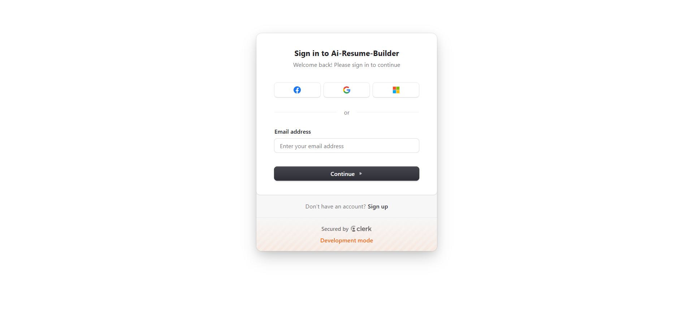
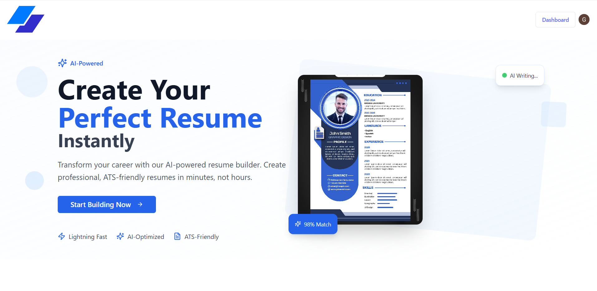
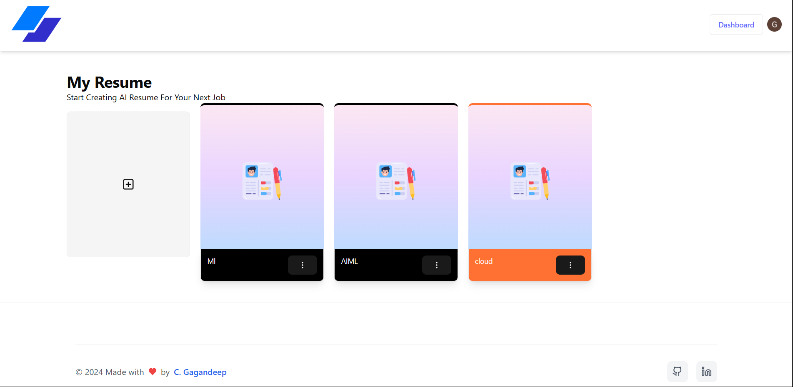
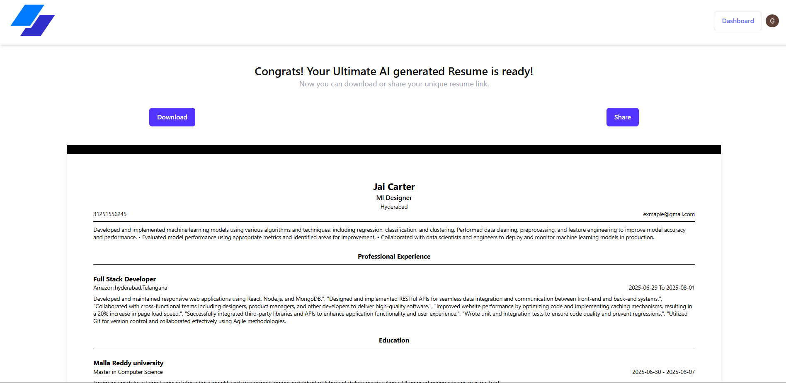

# 🧠 AI Resume Builder

> A full-stack, AI-powered web app that generates custom, job-targeted resumes using Google Gemini Pro LLM. Built with modern web stack and deployed live.

## 🚀 Demo

🔗 [Live Demo](https://resume-x-ai.vercel.app/)  

📁 [GitHub Repo](https://github.com/GaganDC/ResuemX-AI)

---

## 🛠️ Tech Stack

- **Frontend**: React / Next.js / TailwindCSS
- **Backend/API**: Gemini Pro API (LLM integration), Node.js
- **Auth**: Clerk (passwordless auth, role-based access)
- **CMS**: Strapi (for storing templates & versions)
- **Deployment**: Vercel and Render
- **CI/CD**: GitHub Actions

---

## ✨ Features

- 🔐 User authentication with Clerk
- 📝 Dynamic form-based resume builder
- 🤖 AI-powered resume generation using Gemini Pro
- 📄 Multiple resume templates with ATS-friendly formatting
- 🌐 Fully deployed and responsive
- 🔄 Resume versioning & live preview

---

## 🧠 Prompt Design (Gemini API)

Used contextual prompting to structure resume sections:


# 🧠 AI Resume Builder

> A full-stack, AI-powered web app that generates custom, job-targeted resumes using Google Gemini Pro LLM...

...


## 📷 Screenshots

### 🖼️ Login Page

### 🖼️ Home Page


### 🧾 Resume Builder


### 📄 Generated Resume


## 🧪 How to Run Locally

```bash
git clone https://github.com/your-username/ai-resume-builder
cd ai-resume-builder
npm install
npm run dev


